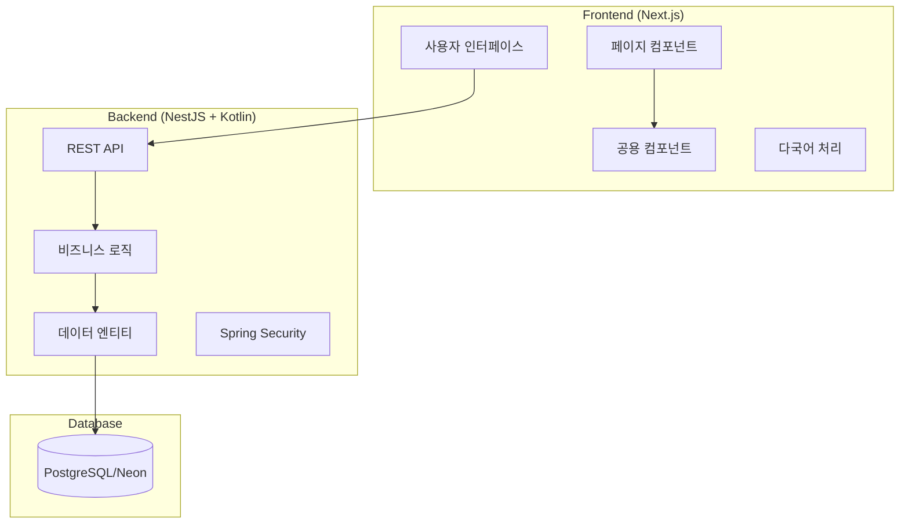
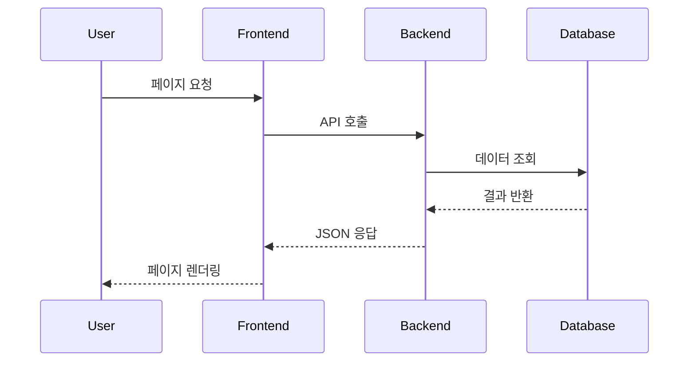

# 시스템 패턴

## 전체 아키텍처



## 핵심 설계 패턴

### 1. 페이지 기반 라우팅
```
frontend/src/app/
├── [lng]/                 # 다국어 라우팅
│   ├── page.tsx           # 메인 페이지
│   ├── service-guide/     # 서비스 안내
│   ├── accommodation-guide/ # 숙소 안내
│   ├── membership/        # 멤버십
│   ├── request-delivery/  # 배송 신청
│   └── reviews/           # 후기
└── admin/                 # 관리자 페이지
    ├── dashboard/
    ├── reservations/
    └── accommodations/
```

### 2. 컴포넌트 패턴
- **Page Components**: 각 페이지의 메인 컴포넌트
- **Shared Components**: 재사용 가능한 공용 컴포넌트
- **Layout Components**: 네비게이션, 푸터 등 레이아웃

### 3. 데이터 흐름 패턴


## 주요 컴포넌트

### Frontend 컴포넌트
1. **AccommodationsList**: 실제 DB 숙소 데이터 표시
2. **FAQSection**: 자주 묻는 질문
3. **ReviewsCarousel**: 고객 후기 슬라이드
4. **HeroBackground**: 메인 페이지 배경
5. **Admin Components**: 관리자 대시보드/예약/숙소 관리

### Backend 엔티티
1. **Accommodation**: 숙소 정보
   - 기본 정보 (이름, 주소, 연락처)
   - 배송 정보 (시간, 요금, 특이사항)
   - 위치 정보 (GPS 좌표)

2. **Reservation**: 예약 정보 (향후 구현)
3. **User**: 사용자 정보 (향후 구현)
4. **Driver**: 기사 정보 (향후 구현)

## API 설계 패턴

### RESTful API 구조
```
/api/accommodations
├── GET    /           # 전체 숙소 목록
├── GET    /active     # 활성 숙소만
├── GET    /:id        # 특정 숙소 상세
├── POST   /           # 새 숙소 등록
├── PUT    /:id        # 숙소 정보 수정
└── DELETE /:id        # 숙소 삭제
```

### 응답 형식
```json
{
  "id": "uuid",
  "name": "숙소명",
  "address": "주소",
  "detailAddress": "상세주소",
  "latitude": 35.6581,
  "longitude": 139.7013,
  "deliveryStartTime": "09:00:00",
  "deliveryEndTime": "21:00:00",
  "deliveryFee": 35000,
  "isActive": true,
  "notes": "특이사항",
  "createdAt": "2024-01-15T10:00:00Z",
  "updatedAt": "2024-01-15T10:00:00Z"
}
```

## 보안 패턴

### Spring Security 설정
```kotlin
// 공개 경로
"/api/accommodations/**"  // 숙소 정보 조회
"/api/auth/**"           // 인증 관련
"/public/**"             // 정적 파일

// 인증 필요 경로
"/api/admin/**"          // 관리자 기능
"/api/reservations/**"   // 예약 관리
```

### CORS 설정
```kotlin
@CrossOrigin(origins = ["http://localhost:3000"])
```

## 데이터베이스 패턴

### 테이블 구조
```sql
accommodations (
    id UUID PRIMARY KEY,
    name VARCHAR NOT NULL,
    address TEXT NOT NULL,
    detail_address VARCHAR,
    latitude DECIMAL(10,8),
    longitude DECIMAL(11,8),
    delivery_start_time TIME,
    delivery_end_time TIME,
    delivery_fee INTEGER,
    is_active BOOLEAN DEFAULT true,
    notes TEXT,
    created_at TIMESTAMP DEFAULT CURRENT_TIMESTAMP,
    updated_at TIMESTAMP DEFAULT CURRENT_TIMESTAMP
)
```

## 국제화 패턴

### 다국어 구조
```
frontend/src/locales/
├── ko/common.json    # 한국어
├── ja/common.json    # 일본어 (향후)
└── en/common.json    # 영어 (향후)
```

### 라우팅 패턴
```
/ko/service-guide     # 한국어
/ja/service-guide     # 일본어
/en/service-guide     # 영어
```

## 에러 처리 패턴

### Frontend 에러 처리
1. **Loading State**: 데이터 로딩 중 표시
2. **Error State**: API 오류시 사용자 친화적 메시지
3. **Empty State**: 데이터 없을 때 안내 메시지

### Backend 에러 처리
1. **HTTP Status Codes**: 표준 상태 코드 사용
2. **Error Response**: 일관된 에러 응답 형식
3. **Logging**: 서버 로그를 통한 디버깅

## 성능 최적화 패턴

### Frontend 최적화
- **Code Splitting**: 페이지별 번들 분리
- **Image Optimization**: Next.js Image 컴포넌트 활용
- **Static Generation**: 가능한 페이지는 SSG 적용

### Backend 최적화
- **Database Indexing**: 자주 조회되는 필드 인덱싱
- **Caching**: 정적 데이터 캐싱 (향후 구현)
- **Connection Pooling**: DB 연결 풀 관리 